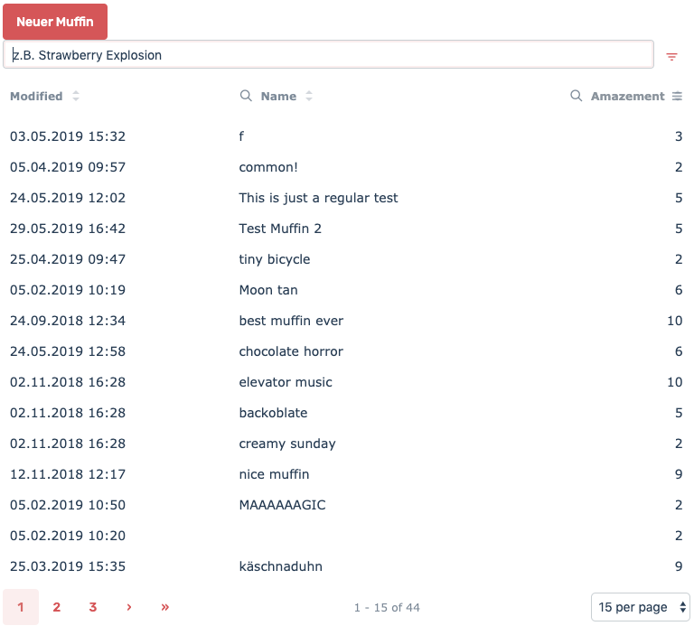

<!--  -->

The CrudComponent (CRUD stands for Create Read Update Delete) is like the meta component that combines most of the other components. By just passing a model name, it renders a list of the model entries (Read). Pressing the "+" button opens a modal to add new entries (Create). Clicking a row in the list opens a modal to modify (Edit) or remove (Delete) entries.

## Basic Example

```html
<ec-crud model="muffin"></ec-crud>
```

## Used Components

- [entry-list](entry-list.component.md) available as entryList property
- [entry-pop](entry-pop) available as entryPop property

## Outputs

### columnClicked

The columnClicked Output will be emitted when an entry is clicked. You get an Item containing the clicked entry as _$event_:

```html
<ec-crud model="muffin" (columnClicked)="clickedMuffin($event)"></ec-crud>
```

now you could e.g. navigate to a detail page:

```ts
clickedMuffin(muffin: Item<EntryResource>) {
  this.router.navigate(['muffin', muffin.id()]);
}
```

See [Items](../core-concepts/items.md) for more info on the emitted object.

If you do not use the columnClicked output, clicking an entry will open its edit form.

## Inputs

### config

```html
<ec-crud model="muffin" [config]="muffinCrudConfig"></ec-crud>
```

See 

- [Config Pipeline](../core-concepts/config-pipeline) for other ways to pass configuration.
- [Form API](../core-concepts/form-options) for the options affecting the form.
- [List API](../core-concepts/list-options) for the options affecting the list.
- [Entry Pop](entry-pop) for the options affecting the entry-pop.

### config.methods

You can control the available actions by methods

- post: Create
- get: Read
- put: Update
- delete: Delete

```ts
muffinCrudConfig = {
  methods: ['get', 'put'],
};
```

This will disable creating and deleting entries.

**Default Methods**

By default, the crud component will respect the active users permissions, meaning a create button will only be visible if the user is allowed to create entries. The same goes for delete and save buttons. See [Accounts & Rights](../core-concepts/accounts.md) for more info. If you pass methods to the config, those will always be used.

### config.createLabel

Changes the Label of the create button

### config.fields

See [Fields Config](../core-concepts/config-options.md).
The fields option defines which fields should be visible, and how they should look. This will affect the list and form.
