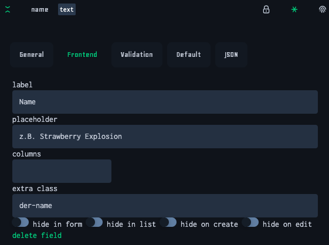

The following ways can be used to configure a models behaviour in one or more components. This applies to all components that use a model and config input:

- [ec-crud](../components/crud.component.md)
- [ec-entry-list](../components/entry-list.component.md)
- ec-entry-form
- ec-entry-select

## Different Streams

The configuration works like a pipeline, with the following "streams":

- [default config](#default-config)
- [by ec.editor](#by-eceditor)
- [by ModelConfigService](#by-modelconfigservice)
- [by field type](#by-field-type)
- [by Component Input](#by-component-input)

Based on the default config, each "stream" is merged into the previous one.

### default config

The default config is generated from the model's schema. If you don't use your own config, that default config will be used. If you pass your own config, that config will be assigned to the default config, meaning you only need to specify values that should differ from the default.

For example, here's a simplified extract of a [typical model schema](https://datamanager.cachena.entrecode.de/api/schema/83cc6374/muffin):

```json
{
  "properties": {
    "name": {
      "type": "string",
      "title": "text",
      "description": "Name des Muffins",
      "default": "",
      "readOnly": false
    },
    "amazement_factor": {
      "type": "number",
      "minimum": 1,
      "maximum": 10,
      "multipleOf": 1,
      "title": "number",
      "description": "Wie amazing ist er?",
      "default": 0,
      "readOnly": true
    }
  },
  "required": ["name", "amazement_factor"]
}
```

This schema is then used generate a base configuration for that model. For example, the type value determines how the field will look like in, as described [here](./default-inputs.md).

### by ec.editor

Inside the [ec.editor](https://e.entrecode.de) you can configure basic things like label, placeholder columns classes and input-views. Just go to the model config and open the "Frontend" tab of a field:



This way of configuration can be used to alter a project without touching its code > no deployment needed. In the future, more options could be available here.

This will only work if you do not override the affected fields in your project directly (using the first two methods). This way of configuration should always be used in favor of the first two.


### by ModelConfigService

Another way to configure a model is by using the ModelConfigService:

```ts
class AppComponent {
  constructor(public modelConfig: ModelConfigService) {
    this.modelConfig.set('muffin', {
      /* muffin config */
    });
  }
}
```

This will automatically set the configuration of **all** components that use the model muffin:

```html
<ec-crud model="muffin"></ec-crud><!-- is affected by model config -->
```

This method affects lists like the ones that can be opened from entry-selects, where you have no control over the template and therefor cannot pass a config directly.

You should always use this way for the default model config. Special behaviour for a single page should be set up by component input.

### by field type

You can also set a global config for all fields of a certain type, using the FieldConfigService:

```ts
import MyFancyJsonEditorComponent from 'my-fancy-json-editor';

class AppComponent {
  constructor(public fieldConfig: FieldConfigService) {
    this.fieldConfig.set('json', {
      input: MyFancyJsonEditorComponent,
    });
  }
}
```

If you now use a form with a field of type 'json', it will use "MyFancyJsonEditorComponent" to edit the field. This way of configuration is also recommended when using extra packages like the location-picker.

### by Component Input

By passing a config to a component input, only that component and its children are affected:

```html
<ec-crud model="muffin" [config]="muffinConfig"></ec-crud><!-- affected -->
<ec-crud model="muffin"></ec-crud><!-- not affected -->
```

### TL;DR

use

- editor to configure labels and placeholders
- type-config for location-picker and json fields
- model-config for the rest
- use component config only for single use cases

## resource config

For resource-lists and forms, the same rules apply, but you should use ResourceConfigService in place of ModelConfigService. The editor configuration is not available for resources.
