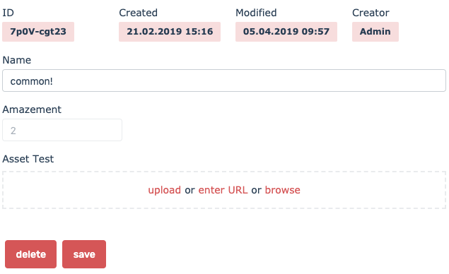

This document shows which config options can be used to control forms.

## Example

For all following snippets, let's assume the following template

```html
<ec-entry-form model="muffin" [config]="muffinConfig" #muffinForm></ec-entry-form>
```

... made available:

```ts
class AppComponent {
  @ViewChild('muffinForm') muffinForm;
  muffinConfig = {
    /* config here */
  };
}
```

## form components

import { ComponentsOverview } from '../../ComponentsOverview.js';

<ComponentsOverview
  visibleNodes={['ec-form', 'ec-entry-form', 'ec-resource-form']}
  showCheckboxes={false}
  height={200}
  width={600}
/>

The techniques of this document apply to the following components:

| components       | description                                                               | package             |
| ---------------- | ------------------------------------------------------------------------- | ------------------- |
| ec-form          | base form component. Parent of all other forms. Not datamanager specific. | @ec.components/ui   |
| ec-entry-form    | form for model entries.                                                   | @ec.components/data |
| ec-resource-form | form for resources of ec apis (like datamanagers, models, apps etc..)     | @ec.components/data |

Also check out [Config Pipeline](./config-pipeline.md) for other ways to set the config.

### components using forms

<ComponentsOverview
  visibleNodes={[
    'ec-form',
    'ec-entry-form',
    'ec-crud',
    'ec-select',
    'ec-entry-select',
    'ec-list-header',
    'ec-input',
    'ec-entry-pop',
    'ec-resource-select',
  ]}
  showCheckboxes={false}
  height={400}
  width={600}
/>

The following components use forms as a part of their functionality:

- ec-crud
- ec-entry-pop
- ec-list-header (filter inputs)

To alter the config of forms that are part of those components, you can use the [Config Pipeline](./config-pipeline.md).

## parts

A typical form looks like this:



The form consists of three main parts:

### header

This part is only relevant for entry forms. It displays the four immutable system fields. Values can be copied by click.

### body

The form body contains all field inputs. The look and behaviour of each form field depends on its type.

### footer

Contains buttons. In entry forms, the buttons depend on the permissions of the user. If all permissions are granted, a save button and a delete button will be shown.

## field config

The following field options control the forms looks/behaviour:

| option              | description                                                | type                    |
| ------------------- | ---------------------------------------------------------- | ----------------------- |
| field.hideInForm    | if true, the field will not be visible.                    | boolean                 |
| field.form          | if false, the field will not be visible and not be loaded. | boolean                 |
| field.label         | label above input                                          | string                  |
| field.placeholder   | input placeholder                                          | string                  |
| field.columns       | how many columns are used by the field                     | number 1-12             |
| field.immutable     | if true, the property won't be sent when saving            | boolean                 |
| field.readOnly      | if true, the property won't be editable                    | boolean                 |
| field.required      | if true, the field needs to be filled out                  | boolean                 |
| field.prefill       | prefill value for new entries                              | any                     |
| field.input         | custom input component                                     | Component               |
| field.formComponent | custom input component used in form only                   | Component               |
| field.inputView     | view for input component                                   | string                  |
| field.validate      | transformation for form validation                         | transformation function |
| field.changed       | callback when a field changes                              | (value, form)           |

## validate

To apply custom validation magic to your fields, you can use the validate transformation:

```ts
muffinFormConfig = {
  fields: {
    name: {
      validate: (value) => {
        if (value === 'Captain Crumble') {
          return 'This Name is copyrighted, do not use it';
        }
      },
    },
    amazement_factor: {
      validate: (value) => {
        if (value > 10 || value < 1) {
          return 'Must be between 1 and 10';
        }
      },
    },
  },
};
```

It will run when the field values changes. If anything is returned, it is interpreted as a malicious input. The message is outputted below the field.

For custom input components, you can display the validation error by placing this somewhere in your template:

```html
<ec-input-errors [control]="control"></ec-input-errors>
```

## input views

<ComponentsOverview
  visibleNodes={[
    'ec-form',
    'ec-entry-form',
    'ec-resource-form',
    'ec-input',
    'ec-default-input',
    'ec-default-entry-input',
  ]}
  showCheckboxes={false}
  height={400}
  width={600}
/>

### available input views

Setting inputView on a field will control the input that is used. By default, the most common inputs are implemented in the components.
Most views are derived from the [field types of the entrecode API](https://doc.entrecode.de/data_manager/#types).

| inputView         | for type         | description                     | is default | specials                                                 |
| ----------------- | ---------------- | ------------------------------- | ---------- | -------------------------------------------------------- |
| string            | text             | normal text input               | X          |
| textarea          | formattedText    | textarea input                  | X          |
| number            | number + decimal | number input                    | X          |
| color             | text             | HTML5 color input               |            |
| boolean           | boolean          | checkbox                        | X          |
| email             | email            | email input                     | X          |
| url               | url              | url input                       | X          |
| toggle            | boolean          |                                 |
| date              | datetime         | ec-datetime                     | X          |
| select            | text             | html select                     |            | values                                                   |
| copy              | any              | click to copy                   |            | uses copy transformation                                 |
| phone             | phone            | phone input                     | X          |                                                          |
| entry-select      | entry            | shows entry-select              | X          | expects validation to be set to model title              | can pass nestedCrudConfig |
| entries-select    | entries          | shows entry-select              | X          | expects validation to be set to model title              | can pass nestedCrudConfig |
| entries-actionbar | entries          | shows actionbar                 |            | works without validation                                 |
| entry-list-select | entries          | renders entry-list of selection |            | will load the entry with levels 2 request                |
| asset-select      | asset            | single asset select             | X          | for legacyAssets (no assetGroup set in field validation) |
| assets-select     | assets           | multiple assets select          | X          | for legacyAssets (no assetGroup set in field validation) |
| dmAsset-select    | dmAsset          | single dmAssets select          | X          | expects validation to be set to assetGroupID             |
| dmAssets-select   | dmAssets         | multiple dmAssets select        | X          | expects validation to be set to assetGroupID             |

not passing an inputView will use the default inputView. If you pass an invalid inputView (not existing), the field's value will be displayed.

sources:

- [default-input](https://github.com/entrecode/ec.components/blob/master/packages/ui/src/lib/form/default-input/default-input.component.html)
- [default-entry-input](https://github.com/entrecode/ec.components/blob/master/packages/data/src/lib/entry-form/default-entry-input.component.html)

### inputView in the editor

In the model field config of the [ec.editor](https://e.entrecode.de), you can also select a default inputView in the frontend tab. Currently, this is only possible for entries fields, but will be available for more in the future (TODO: add inputViews to type-config.service).

### entry-select + entry-selects

As you see above, entry/entries fields will default to inputViews entry-select / entries-select. You can customize the entry select via nestedCrudConfig, which is passed to the entry-select:

```ts
bakerConfig = {
  fields: {
    /* other fields */
    baked_muffins: { // entries field
      nestedCrudConfig: {
        disableSearchbar: true
        disableDrag: true
        disableRemove: true
        disableSearchbar: true
        disableCreatePop: true
        /* or use methods */
        methods: ['get','put','post','delete']
      }
    }
  }
}
```

The nestedCrudConfig is also passed down to the children of entry-select: entry-list-pop & entry-pop. You could of course also pass a fields config but it is recommended you use ModelConfigService. See [Configuration](configuration#by-modelconfigservice) for details.

### select

To render a html select with options:

```ts
const muffinConfig = {
  fields: {
    /* .. */
    country: {
      inputView: 'select',
      values: ['Germany', 'USA', 'Kongo'],
    },
  },
};
```

### copy

To render a copyable date:

```ts
const muffinConfig = {
  fields: {
    /* .. */
    _created: {
      inputView: 'copy',
      copy: (value) => moment(value).toISOString(),
    },
  },
};
```

This uses the copy transform to turn the date into an iso string before copying. If you do not define a copy transform, the value will be copied as is (as returned by resolve).

## custom form components

You can pass your own components to use them as input

### counter example

```ts
this.modelConfig.set('muffin', {
  fields: {
    /* .. */
    count: {
      input: CounterComponent,
    },
  },
});
```

The passed component will be loaded dynamically into the respective ec-input, which is part of the form.

The following template renders the counter:

```html
<div class="input-group">
  <div class="input-group__addon">
    <a class="btn btn_clear btn_small is-bold" (click)="decrement()">-</a>
    <div class="input">{{ value }}</div>
    <a class="btn btn_clear btn_small is-bold" (click)="increment()">+</a>
  </div>
</div>
```

To have control to the form input's value, you need to use angulars ControlValueAccessor:

```ts
import { Component, OnInit, Input } from '@angular/core';
import { InputComponent } from '../../../packages/ui';
import { ControlValueAccessor } from '@angular/forms';

@Component({
  selector: 'app-counter',
  templateUrl: './counter.component.html',
})
export class CounterComponent extends InputComponent implements ControlValueAccessor {
  value = 0;

  increment() {
    this.propagateChange(++this.value);
  }

  decrement() {
    this.propagateChange(--this.value);
  }

  writeValue(value: any) {
    this.value = value;
    console.log('received value', value);
  }

  propagateChange = (_: any) => {};

  registerOnChange(fn) {
    this.propagateChange = fn;
  }

  registerOnTouched() {}
}
```

Now you can implement your own logic and call propagateChange when you change the value from your component, and react to change via the writeValue method!
You now could also use your component with ngModel or formControl in another context!
More information on this pattern: https://blog.thoughtram.io/angular/2016/07/27/custom-form-controls-in-angular-2.html

### container example

Instead of using a single component for one specific field, you could also use one component to serve as a container for multiple possible views:

```ts
this.modelConfig.set('muffin', {
      fields: {
        /** */
        url: {
          label: 'URL',
          inputView: 'speakingurl',
          input: CustomInputComponent
        },
        count: {
          label: 'Count',
          inputView: 'counter',
          input: CustomInputComponent
        }
})
```

The component is rather simple:

```ts
import { Component } from '@angular/core';
import { InputComponent } from '@ec.components/ui';

@Component({
  selector: 'app-custom-input',
  templateUrl: './custom-input.component.html',
  styleUrls: ['./custom-input.component.scss'],
})
export class CustomInputComponent extends InputComponent {}
```

Extending InputComponent enables you to use the following properties in your template:

- control FormControl instance
- group FormGroup instance
- field Field instance
- item Item instance
- config
- property

```html
<div [ngSwitch]="field.getView('input')" *ngIf="group" [formGroup]="group">
  <ec-input-errors [control]="group.get(field.property)"></ec-input-errors>
  <div *ngSwitchCase="'speakingurl'">
    <input [id]="field.id" type="text" [formControl]="control" />
  </div>
  <div *ngSwitchCase="'counter'">
    <app-counter [formControl]="control"></app-counter>
  </div>
</div>
```

Of course you could also switch based on property name or type, depending on your application.
The id property of field is referenced in the label of the form. By adding it to the input makes sure your label click enters the input.

### entryComponents

Because the custom component will be loaded dynamically, your module needs to declare it as entryComponent:

```js
@NgModule({
  entryComponents: [CounterComponent, CustomInputComponent],
  /** more stuff **/
})
export class AppModule {}
```

## custom form markup

To use your own markup for a form, you can use one of the following approaches.

### via ec-input + ec-output

ec-input and ec-output can be used to render a fields input:

```html
<ec-entry-form model="muffin" #form>
  <!-- input -->
  <label
    >Title
    <ec-input property="title" [item]="form.form" [group]="form.group"></ec-input>
  </label>
  <!-- output -->
  <label>Amazement Factor</label>
  <ec-output property="amazement_factor" [item]="form.form" [group]="form.group"></ec-output>
  <a class="btn" (click)="form.submit()">Submit</a>
</ec-entry-form>
```

As soon as the ec-entry-form contains elements (or you pass empty=true, as mentioned below), the contents will be rendered instead of the default form.

Features you have to add manually (if needed)

- submit button
- layout (field.columns will be ignored)

NOTE: dont wrap labels around complex input components, because they fire ghost clicks!

### via form controls

If you do not want to use ec-input, you can also access the form controls directly:

```html
<ec-entry-form model="muffin" #form>
  <!-- input -->
  <label>Title</label>
  <input type="text" [formControl]="form.group.get('title')" />
  <ec-input-errors [control]="form.group.get('title')"></ec-input-errors>

  <a class="btn" (click)="form.submit()">Submit</a>
</ec-entry-form>
```

As you see, the _ec-input-errors_ component can be used to automatically handle validation errors.
That component is also used by the default input components which will be loaded by ec-input.
Note that you will have to manually have to care for:

- readOnly state
- placeholder
- label
- error handling (use ec-input-errors)
- layout (field.columns will be ignored)

Consider using ec-input instead to get the component sugar + lower mainetenance cost.
