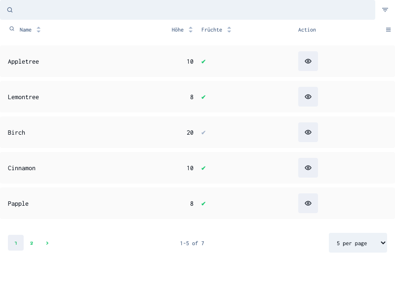

This document shows which config options can be used to control lists.

## Example

For all following snippets, let's assume the following template

```html
<ec-entry-list model="muffin" [config]="muffinConfig" #muffinList></ec-entry-list>
```

... made available:

```ts
class AppComponent {
  @ViewChild('muffinList') muffinList;
  muffinConfig = {
    /* config here */
  };
}
```
See [Config Pipeline](./config-pipeline.md) for ways to pass config options.

## list components

import { ComponentsOverview } from '../../ComponentsOverview.js';

<ComponentsOverview
  visibleNodes={['ec-list', 'ec-entry-list', 'ec-resource-list']}
  showCheckboxes={false}
  height={200}
  width={600}
/>

The techniques of this document apply to the following components:

| components       | description                                                               | package             |
| ---------------- | ------------------------------------------------------------------------- | ------------------- |
| ec-list          | base list component. Parent of all other lists. Not datamanager specific. | @ec.components/ui   |
| ec-entry-list    | list for model entries.                                                   | @ec.components/data |
| ec-resource-list | list for resources of ec apis (like datamanagers, models, apps etc..)     | @ec.components/data |


### components using lists

The following components use lists as a part of their functionality:

- ec-crud
- ec-select
- ec-entry-select
- ec-resource-select

To alter the config of lists that are part of those components, you can use the [Config Pipeline](./config-pipeline.md).

## parts

A typical list looks like this:



The list consists of three main parts:

<ComponentsOverview
  visibleNodes={['ec-list', 'ec-list-header', 'ec-list-items', 'ec-pagination']}
  showCheckboxes={false}
  height={300}
  width={600}
/>

### list-header

- The list header displays the column labels and controls the sorting, filtering and visibility of the fields. Fields can be sorted by clicking on the arrows beneath the field label or by using the sort dropdown.
- The searchbar at the top filters the list. Depending on the field type, the searchbar may look different. A field's searchbar can be shown by clicking the maginifying glass.
- The burger menu on the right controls the visibility of the fields

### list-items

Each row is one entry of data. The values are formatted depending on the field types using ec-output. Clicking an item will trigger the columnClicked output.

### footer

The footer shows the pagination of the list.

## visibility

The following options control the visibility of fields.

| option                   | description                                                                                         | type    |
| ------------------------ | --------------------------------------------------------------------------------------------------- | ------- |
| field.hideInList         | if true, the field will not be visible, but can be made visible via the column filter.              | boolean |
| field.list               | if false, the field will not be visible and not be loaded. It will not appear in the column filter. | boolean |
| field.hideInColumnFilter | if true, the field's visibility cannot be toggled from the column filter.                           | boolean |

## sorting

The following options are related to sorting lists:

| option                           | description                                           | type    |
| -------------------------------- | ----------------------------------------------------- | ------- |
| [field.sortable](#fieldsortable) | if true, the field can be sorted from the list-header | boolean |
| [config.sortBy](#configsortby)   | the property that should be sorted after              | string  |
| [config.desc](#configdesc)       | if true, the sorting will be descending               | string  |

### Full Example

```ts
muffinConfig = {
  sortBy: 'amazement_factor',
  desc: true,
  fields: {
    /* other fields */
    amazement_factor: {
      sortable: true,
    },
  },
};
```

### field.sortable

If true, the column can be sorted by clicking the column header, as indicated by two arrows:


The first click sorts ascending, the second descending and the thirds resets the sorting.

### config.sortBy

The field property by which the list should be sorted:

```ts
this.muffinList.list.load({ sortBy: 'amazement_factor' });
```

### config.desc

If true, the sorting will be in descending order:

```ts
this.muffinList.list.load({ sortBy: 'amazement_factor', desc: true });
```

Also see [entry-list.load](../components/entry-list.component.md#load).

## filtering

The following options are related to filtering lists:

| option                              | description                                                                                              | type      |
| ----------------------------------- | -------------------------------------------------------------------------------------------------------- | --------- |
| [filterable](#filterable)           | if true, the field can be filtered from the list-header                                                  | boolean   |
| [filterOperator](#filteroperator)   | the filterOperator that should be used. See [sdk filter doc](https://entrecode.github.io/ec.sdk/#filter) | boolean   |
| [filterComponent](#filtercomponent) | custom component to be used for filtering                                                                | Component | X |
| [rawFilter](#rawfilter)             | if set, the filter value will used as is (without filter operator)                                       | boolean   |

### field.filterable

If true, a clickable search icon will be shown in the list-header, beneath the label:


Clicking the icon opens a filter input above the list-header. By default, the looks/behaviour of the filter input is based on the field's input, see [Input](./config-options.md) for all possible inputViews.

Entering values into the filter input will trigger a list load with the current filter value.

```ts
muffinConfig = {
  fields: {
    amazement_factor: {
      filterable: true,
    },
  },
};
```

In this case, amazement_factor is a number, so the searchbar will be a number input. If you enter a number, the list will load all entries with amazement_factor set to exactly that value.

### field.filterOperator

The sdk accepts [different types of filter operators](https://entrecode.github.io/ec.sdk/#filter) like _exact_, _search_, _from_, _any_ etc.
By default, the filter input will use the most common filterOperator for the field's type.

| type             | default filterOperator |
| ---------------- | ---------------------- |
| id               | search                 |
| text             | search                 |
| boolean          | exact                  |
| formattedText    | search                 |
| decimal          | search                 |
| number           | search ?               |
| url              | search                 |
| asset, dmAsset   | exact                  |
| assets, dmAssets | any                    |
| email            | search                 |
| datetime         | search ?               |
| entry            | exact                  |
| entries          | any                    |
| json             | search ?               |
| location         | search ?               |
| account          | exact                  |
| role             | search ?               |

Fields marked with "?" are experimental.

You can set filterOperator to any other value to alter that default value:

```ts
muffinConfig = {
  fields: {
    amazement_factor: {
      filterable: true,
      filterOperator: 'to', // input will act as 'max' value
    },
    _created_: {
      filterable: true,
      filterOperator: 'from', // input will act as 'min' date
    },
    name: {
      filterable: true,
      filterOperator: 'exact', // only muffins with exactly that name
    },
  },
};
```

### field.rawFilter

This flag can be used to indicate that the filter input value should be used directly as filter value in the sdk:

```ts
muffinConfig = {
  fields: {
    amazement_factor: {
      rawFilter: true
    },
};
amazingMuffinFilter = {
  amazement_factor: {
    from: 8
  }
}
```

This can be helpful for triggering custom filters:

```html
<ec-entry-list #muffinList model="muffin" [config]="muffinConfig"></ec-entry-list>
<a (click)="muffinList.load({ filter: amazingMuffinFilter })">Only 8+</a>
```

Also see [EntryList.load](../components/entry-list.component.md#load)

### field.filterComponent

If you want to use a different component just for filtering, you can define one via the _filterComponent_ option.

```ts
muffinConfig = {
  fields: {
    amazement_factor: {
      filterable: true,
      filterComponent: MyCustomNumberFilter,
    },
  },
};
```

## pagination

The following config options alter the pagination:

| option                         | description                                                                    | type       |
| ------------------------------ | ------------------------------------------------------------------------------ | ---------- |
| paginationConfig               | controls the looks of pagination elements                                      | Object     |
| paginationConfig.range         | Controls the number of pages before and after the current page. Defaults to 3. | number     |
| paginationConfig.hideFirstLast | If true, no first/last buttons will be shown.                                  | boolean    |
| paginationConfig.hidePages     | If true, no pages will be shown                                                | boolean    |
| hidePagination                 | No pagination will be shown                                                    | boolean    |
| size                           | how many items are on one page. Defaults to 25                                 | number     |
| availableSizes                 | how many available page sizes can be selected. Defaults to `[10, 25, 50, 100]` | number[]   |
| pagination                     | external pagination instance                                                   | Pagination |

### external pagination

The ec-pagination component can be used to display a pagination anywhere + how often you want:

```html
<ec-pagination [pagination]="muffinList?.list?.pagination"></ec-pagination>
<!-- any custom markup (dont use *ngIf) -->
<ec-entry-list #muffinList model="muffin" [config]="{hidePagination:true}"></ec-entry-list>
<!-- any custom markup (dont use *ngIf) -->
<ec-pagination [pagination]="muffinList?.list?.pagination"></ec-pagination>
```

## value transformation

To modify your field value for certain contexts, you can use transform function:

```ts
const personConfig = {
  fields: {
    name: {
      display: (value) => value.toUpperCase(),
      group: (value) => value.length + ' Buchstaben',
      sort: (value) => value.length,
    },
  },
};
```

| option      | description                                           | type                    |
| ----------- | ----------------------------------------------------- | ----------------------- |
| resolve     | resolves value for transformation                     | function                |
| copy        | transformation to copy the fields value               | transformation function |
| display     | transformation to display the fields value            | transformation function |
| sort        | transformation to sort fields                         | transformation function |
| group       | transformation to group the fields value when sorting | transformation function |
| queryFilter | transformation for query param to filter value        | transformation function |

As you see, a transform function accepts a value and outputs a transformation of that value (or anything you want).

## transforms

If you want to modify your field value in a certain context, you can use transforms:

### display

The display transform method is used to show the value in a readable format.
It is called from inside ec-output, which is used in list-cells.
You can change the display behaviour like this:

```ts
this.modelConfig.set('muffin', {
  fields: {
    amazement_factor: {
      display: (value, item) => {
        if (value === 10) {
          return 'AMAZING!';
        } else if (value > 7) {
          return 'amazing';
        }
        return 'not so amazing';
      },
    },
  },
});
```

Now, each muffin's amazement_factor will be replaced by the labels defined above.

### group

You can use grouping to get a clearer outline over sorted data:

```ts
this.modelConfig.set('muffin', {
  fields: {
    amazement_factor: {
      group: (value, item) => {
        if (value === 10) {
          return 'AMAZING!';
        } else if (value > 7) {
          return 'amazing';
        }
        return 'not so amazing';
      },
    },
  },
});
```

The syntax is the same as for display but the result is used as a group label when the property is sorted.

### resolve

You can also define pseudo properties, meaning properties that do not exist on the original object:

```ts
this.modelConfig.set('muffin', {
  fields: {
    ranking: {
      resolve: (body, item) => (body.amazement_factor * body.flavour) / body.price,
    },
  },
});
```

This comes in handy when you want to display a often combined value out of multiple values.

NOTE: pseudo properties should not be passed to the backend. Use immutable: true for hide the field from the form via form: false.

## output view

<ComponentsOverview
  visibleNodes={['ec-list-items', 'ec-output', 'ec-default-output', 'ec-dynamic-slot']}
  showCheckboxes={false}
  height={200}
  width={600}
/>

### default output views

Setting outputView on a field will control how the fields looks in the list. By default, the most common outputs are implemented in the components.
Most views are derived from the [field types of the entrecode API](https://doc.entrecode.de/data_manager/#types).

| outputView | for type         | description                | is default | specials                                              |
| ---------- | ---------------- | -------------------------- | ---------- | ----------------------------------------------------- |
| tags       | entries          | tags                       | X          | expects array as display value                        |
| tag        | entry            | single tag                 | X          |
| boolean    | boolean          | checkbox icon              | X          |
| date       | datetime         | date display               | X          |                                                       |
| email      | email            | mailto link                | X          |                                                       |
| url        | url              | link                       | X          |                                                       |
| color      | text             | color sample               |            |
| asset      | asset            | tape icon                  | X          |
| assets     | assets           | tape icon with asset count | X          |
| dmAsset    | dmAsset          | img icon                   | X          |
| dmAssets   | dmAsset          | img icon with asset count  | X          |
| avatar     | asset, dmAsset   | img avatar                 |            | expects url as display value                          |
| avatars    | assets, dmAssets | img avatars                |            | expects url array as display value                    |
| preview    | asset, dmAsset   | img                        |            | expects url as display value                          |
| link       | -                | button custom action       |            | optional icon, class, expects action method to be set |
| textarea   | formattedText    | displays a "text" tag      | X          |
| json       | json             | displays a "JSON" tag      | X          |
| string     | text             | text display               | X          |

- see sources of [default-output](https://github.com/entrecode/ec.components/blob/master/packages/ui/src/lib/form/default-output/default-output.component.html)

not passing an outputView will use the default. If you pass an invalid outputView (not existing), the field's value will be displayed.

### link

To render a button with a custom action:

```ts
const muffinConfig = {
  fields: {
    /* .. */
    eat: {
      outputView: 'link',
      class: 'btn',
      action: (item) => {
        console.log('You took a bite! of ' + item.display());
      },
      icon: 'crumble',
      form: false, // or use immutable: true if you want the button in the form
    },
  },
};
```

Note that the property 'eat' does not need to exist on your muffin model. You can create any property you want, just make sure it isn't sent when saving (by using immutable: false or form: false).

## custom output component

If you want custom cell values that require a custom markup, you can use a custom output component:

```ts
this.modelConfig.set('muffin', {
  fields: {
    amazement_factor: {
      listComponent: StrongComponent,
      // output: StrongComponent,
    },
  },
});
```

In your strong.component.ts, you can inherit OutputComponent, giving you access to the field and item of your cell:

```ts
@Component({
  selector: 'app-strong',
  template: `
    <strong>{{ item.resolve(field.property) }}</strong>
  `,
})
export class StrongComponent extends OutputComponent {}
```

Warning: This option is experimental!

[See Options in API Docs](https://entrecode.github.io/ec.components/interfaces/FieldConfigProperty.html)
